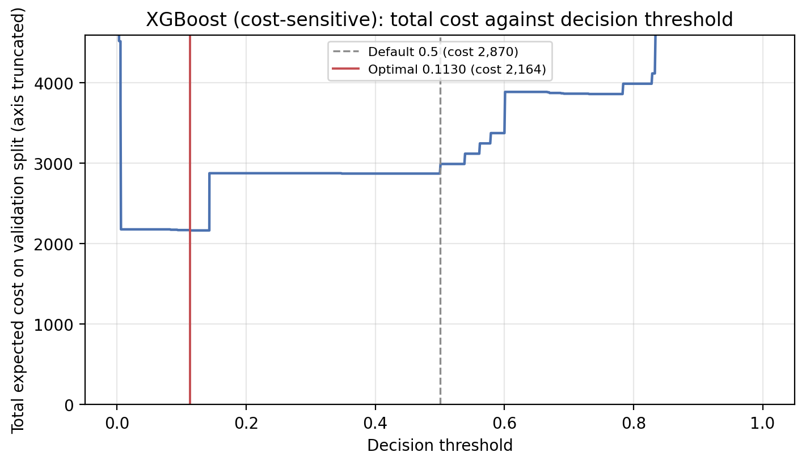
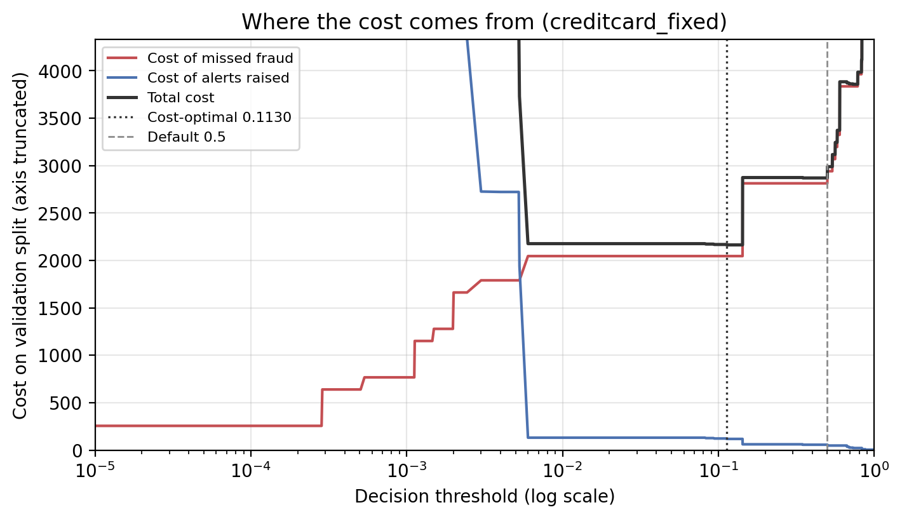
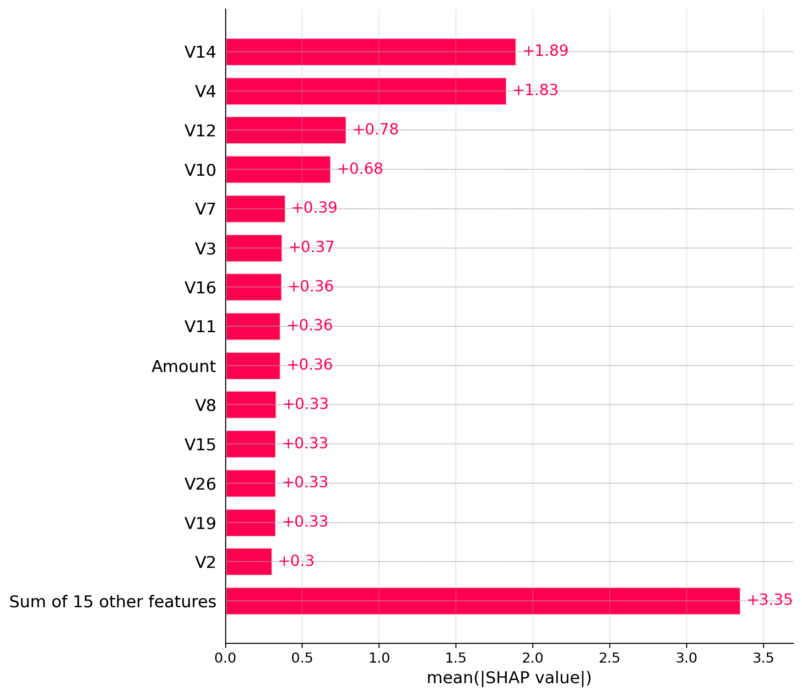

# Cost-Sensitive Fraud Detection

Choosing a fraud detection threshold by what mistakes actually cost, instead of defaulting to 0.5.

MSc thesis implementation — *Cost-Sensitive Learning with XGBoost and SHAP for Optimising Fraud Detection Thresholds in Imbalanced Financial Transaction Data*.

## The idea

Most fraud classifiers flag a transaction when the predicted probability passes 0.5. That default quietly assumes a false positive and a missed fraud cost the same amount, which they don't. Reviewing a legitimate transaction costs staff time. Missing a fraudulent one costs the money.

This project puts explicit costs on each type of error, then picks the threshold that minimises total cost rather than maximising accuracy or F1. It also trains the model itself cost-sensitively, calibrates its probabilities, tests whether the improvement is statistically real, and uses SHAP to check which features the model actually leans on.

## What's in here

- `fraud_detection.ipynb` — the whole pipeline, from loading data to the final results tables. 18 sections, runs top to bottom.
- `figures/` — 40 plots produced by the notebook: cost curves, PR curves, calibration, confusion matrices, SHAP plots.

The notebook has all its output saved, so you can read the results without running anything.

## Results

Four experiments: two datasets (European credit card, PaySim mobile money), each under a fixed cost per missed fraud and an instance-dependent cost equal to the amount at risk.

**It worked on the credit card data.** Cost-sensitive training plus an optimised threshold cut total cost by **22.9%** against the same model at 0.5, and the improvement was statistically significant (exact McNemar, p = 0.0106).

| Model | Threshold | Precision | Recall | AUPRC | Alert rate | Cost reduction |
|---|---|---|---|---|---|---|
| XGBoost baseline @ 0.5 | 0.500 | 0.952 | 0.808 | 0.840 | 0.15% | — |
| XGBoost baseline @ cost-optimal | 0.059 | 0.559 | 0.859 | 0.840 | 0.27% | 14.9% |
| XGBoost cost-sensitive @ cost-optimal | 0.113 | 0.794 | 0.859 | 0.851 | 0.19% | **22.9%** |

The middle row is the interesting one. Just moving the threshold on the ordinary model recovers most of the recall, but at the price of 67 false positives instead of 4. Training the model cost-sensitively as well gets the same recall with only 22 false positives — so the two changes are doing different jobs, and you want both.

All six pre-declared success criteria were met for this experiment: cost reduction, recall, value recall, alert rate, AUPRC, and significance.

**It did not work on PaySim.** Cost reduction came out at **−293%** for the fixed-cost regime and −12.5% for instance-dependent — the method made things worse. The reason is visible in the baseline: XGBoost at 0.5 already scores 0.9995 recall and 0.9995 AUPRC on this data, catching 4,256 of 4,258 frauds with a single false positive. There is nothing left for threshold tuning to recover, so pushing the threshold down to 0.001 only adds review cost for no gain.

That's a finding rather than a failure. PaySim is synthetic and its fraud is close to separable, so it can't tell you much about threshold optimisation. Cost-sensitive thresholding pays off when a model is genuinely uncertain, which is the realistic case.

### Sensitivity to the assumed cost

The cost of a false positive is an assumption, not a measurement, so the notebook sweeps the cost ratio from 2:1 to 250:1:

| Cost ratio | Optimal threshold | Recall | Cost reduction |
|---|---|---|---|
| 2 | 0.348 | 0.808 | −4.8% |
| 5 | 0.113 | 0.859 | 7.1% |
| 10 | 0.113 | 0.859 | 16.5% |
| 25 | 0.113 | 0.859 | 22.3% |
| 50 | 0.113 | 0.859 | 24.3% |
| 100 | 0.113 | 0.859 | 25.3% |
| 250 | 0.005 | 0.859 | 25.9% |

Below about 5:1 the approach isn't worth it. Above that the benefit holds and the chosen threshold is stable across a wide range, which means the result doesn't depend on getting the cost estimate exactly right.

### Figures

Cost against threshold, showing the default and the optimum:



Where the cost comes from — missed fraud versus review effort:



What the model relies on:



## Data

**Credit card** (284,807 transactions, 492 frauds, 578:1 imbalance) downloads automatically from OpenML — no account or API key needed. Released by the Machine Learning Group at ULB, described in Dal Pozzolo et al. (2015).

**PaySim** (6,362,620 transactions, 8,213 frauds, 774:1 imbalance) has to be fetched manually. It's the standard Kaggle release, *Synthetic Financial Datasets For Fraud Detection* (`ealaxi/paysim1`), and it's too large to host here. Download it and place the CSV at:

```
<output dir>/data/PS_20174392719_1491204439457_log.csv
```

where `<output dir>` is `fraud_detection_outputs` locally, or `/content/drive/MyDrive/fraud_detection_outputs` when running on Colab with Drive mounted. The credit card experiments run fine without it; only Experiments 3 and 4 need it.

## Running it

Open the notebook in Colab using the badge at the top of the file, or run it locally with Jupyter. Run every cell from the top — sections 1–11 only define the pipeline, sections 12–18 produce the results.

Expect roughly 28 minutes on a standard Colab CPU instance (2 cores, 12.7 GB RAM): about 1.5 and 2.5 minutes for the credit card experiments, 10 and 14 minutes for PaySim.

```
python 3.13    numpy 2.1.3      pandas 2.2.3       scikit-learn 1.6.1
xgboost 3.4.1  shap 0.52.0      imbalanced-learn 0.14.2   scipy 1.16.3
```

The first cell installs `xgboost`, `shap` and `imbalanced-learn`. Random seed is fixed at 42 throughout.

## Method notes

- **Splits** are 60/20/20 train / validation / test. Validation is split in two disjoint halves: one calibrates probabilities, the other selects the threshold, so the threshold isn't chosen on the data used to calibrate. PaySim is split chronologically; the credit card split is random because the OpenML release has no time column.
- **Calibration** is isotonic regression. Cost-optimal thresholds are meaningless if the probabilities aren't calibrated.
- **Significance** is an exact McNemar test on per-transaction decisions, plus bootstrapped confidence intervals on the mean saving per transaction.
- **Leakage control** drops `nameOrig` and `nameDest` (account identifiers a model can memorise) and `isFlaggedFraud` (the simulator's own rule output, which is target leakage).
- Hyperparameters are fixed rather than tuned. No arm gets an advantage, so the comparison is fair, but absolute numbers are probably conservative.

Section 18 of the notebook lists the limitations in full — worth reading before drawing conclusions from any of the above.

## References

Dal Pozzolo, A., Caelen, O., Johnson, R.A. and Bontempi, G. (2015) Calibrating probability with undersampling for unbalanced classification. *IEEE Symposium Series on Computational Intelligence*.

Elkan, C. (2001) The foundations of cost-sensitive learning. *IJCAI*.

Lopez-Rojas, E.A., Elmir, A. and Axelsson, S. (2016) PaySim: a financial mobile money simulator for fraud detection. *European Modeling and Simulation Symposium*.

Lundberg, S.M. and Lee, S.-I. (2017) A unified approach to interpreting model predictions. *NeurIPS*.
